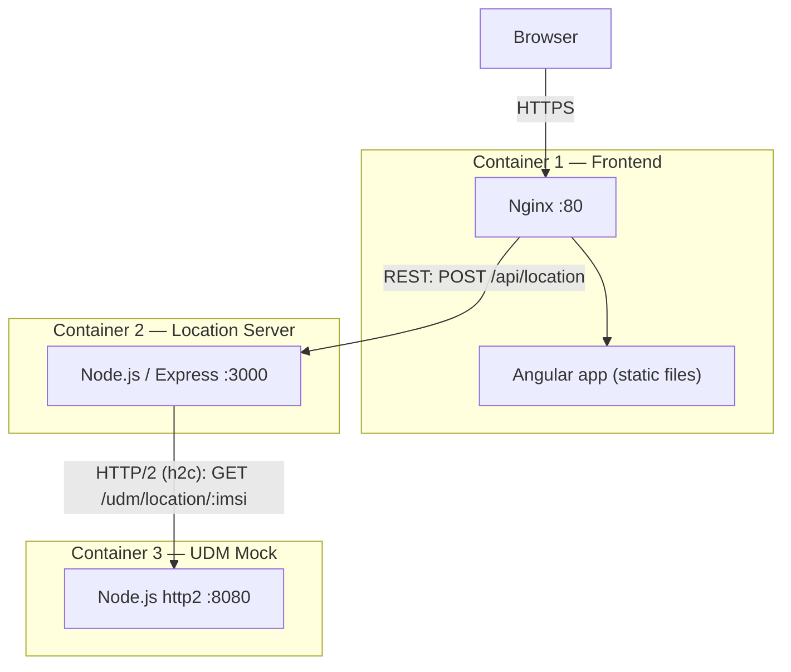

# ECT Location Service Simulator

A small, interview-friendly telecom Location Service simulator built as **three independently deployable containers**: an Angular UI, a Node.js Location Server (REST), and a Node.js UDM Mock speaking **real HTTP/2**.

It exists to demonstrate a clean service-based architecture, not to be a production telecom platform — see [Interview talking points](#interview-talking-points) for what's deliberately out of scope.

## Architecture



```text
Browser
   |
   |  HTTPS
   v
Angular (static files) + Nginx  [Container 1 — frontend]
   |
   |  REST  ·  POST /api/location
   v
Location Server (Node.js/Express)  [Container 2 — location-server]
   |
   |  HTTP/2 (h2c)  ·  GET /udm/location/:imsi
   v
UDM Mock (Node.js http2)  [Container 3 — udm-mock]
```

### Why three separate services

- **Frontend never calls the UDM directly.** The browser only ever knows about the Location Server's REST API (`/api/location`). It has no knowledge of the UDM's existence, address, or protocol. This mirrors how a real OSS/BSS UI should never reach directly into a telecom core network function.
- **The Location Server is the integration boundary.** It owns IMSI validation, orchestration, protocol translation (REST in, HTTP/2 out), and error handling. This is the layer a Solution Architect would extend to call a *real* UDM/NRF-discovered service in a 5G Core, without the frontend ever changing.
- **REST is used at the application edge** (browser/UI-facing) because it's simple, cacheable, and universally tooled.
- **HTTP/2 is used at the network-function edge** (Location Server → UDM) because 3GPP service-based interfaces (SBI) standardize on HTTP/2, typically cleartext ("h2c", prior knowledge) inside a trusted operator network rather than TLS-negotiated ALPN. The UDM Mock's `src/app.js` uses Node's `http2` module directly — this is a genuine HTTP/2 connection, not HTTP/1.1 relabeled.
- **Nginx** serves the compiled Angular static assets and reverse-proxies `/api/*` to the Location Server, so the browser only ever talks to one origin (avoiding CORS in production) while the Location Server's real address stays an internal, env-configured detail.
- **Independent deployability**: each folder is a self-contained Docker build context with its own `Dockerfile` and no shared code. Any one of the three can be rebuilt, redeployed, or scaled without touching the others — which is also exactly how they map onto three separate Render services.
- **Docker networking, not `localhost`**: containers reach each other by Docker Compose service name (`location-server`, `udm-mock`), resolved via Docker's embedded DNS. The frontend's upstream is injected via the `LOCATION_SERVER_URL` environment variable (see [Nginx templating](#nginx-templating)), so the same image works unmodified in Compose and on Render.

## Project structure

```text
ect-location-server/
├── frontend/            Angular UI + Nginx
│   ├── Dockerfile
│   ├── nginx.conf.template
│   └── src/
├── location-server/     Node.js/Express REST API
│   ├── Dockerfile
│   ├── src/
│   └── test/
├── udm-mock/             Node.js HTTP/2 (h2c) mock telecom backend
│   ├── Dockerfile
│   ├── healthcheck.js
│   ├── src/
│   └── test/
├── docker-compose.yml
└── README.md
```

## Run locally with Docker

Requirements: Docker + Docker Compose v2.

```bash
docker compose up --build
```

Then open **http://localhost:4200**.

| Service | Local URL | Purpose |
|---|---|---|
| frontend | http://localhost:4200 | Angular UI (Nginx) |
| location-server | http://localhost:3000 | REST API |
| udm-mock | http://localhost:8080 | HTTP/2 mock UDM |

### Example IMSIs

| IMSI | Result |
|---|---|
| `262011234567890` | Munich, Germany |
| `262021234567891` | Berlin, Germany |
| `262031234567892` | Hamburg, Germany |
| any other 14–15 digit IMSI | Frankfurt, Germany (generic demo fallback) |

## API

### Frontend → Location Server

`POST /api/location`

Request:

```json
{ "imsi": "262010123456789" }
```

Success response (`200`):

```json
{
  "imsi": "262010123456789",
  "location": {
    "country": "Germany",
    "city": "Munich",
    "cellId": "MUC-01",
    "latitude": 48.1351,
    "longitude": 11.582,
    "technology": "5G"
  },
  "subscriber": { "imsi": "262010123456789", "status": "ACTIVE" },
  "source": "UDM-MOCK",
  "protocol": "HTTP/2 (h2c)",
  "latencyMs": 12
}
```

### Location Server → UDM Mock

`GET /udm/location/{imsi}` — called over a **real HTTP/2 (h2c, cleartext) connection**, established with Node's `http2.connect()`/`http2.createServer()`, the same way 3GPP service-based interfaces communicate. There is no HTTP/1.1 fallback on this path.

### Health endpoints

- Location Server: `GET /health` → `{"status":"UP","service":"location-server"}`
- UDM Mock: `GET /health` → `{"status":"UP","service":"udm-mock"}` (also reachable only over HTTP/2 — see [`udm-mock/healthcheck.js`](udm-mock/healthcheck.js), since plain `curl`/`wget` can't speak cleartext HTTP/2 without prior knowledge)
- Frontend (Nginx): `GET /health` → `{"status":"UP","service":"frontend"}`

## Error handling

| Case | Status | Where it's handled |
|---|---|---|
| Missing IMSI | `400` | Location Server — `isValidImsi` |
| Invalid IMSI format (not 14–15 digits) | `400` | Location Server |
| Malformed JSON body | `400` | Location Server (`express.json` parse-error handler) |
| UDM unreachable (connection refused) | `502` | Location Server — `UdmError('UNAVAILABLE')` |
| UDM request timeout (3s default) | `504` | Location Server — `UdmError('TIMEOUT')` |
| Unexpected/invalid UDM response body | `502` | Location Server — `UdmError('BAD_RESPONSE')` |
| Unknown IMSI (valid format, no record) | `200` | UDM Mock returns a deterministic fallback location, since a real UDM would still resolve a valid subscriber |
| Backend REST call fails | shown inline | Frontend — `AppComponent` catches the `LocationService` error and renders it without crashing the UI |

## Frontend architecture

```text
AppComponent  (UI, user interaction, loading/error state)
     |
     v
LocationService  (HTTP call, request/response typing)
     |
     v
POST /api/location
```

- `app.component.ts` only owns UI state (`loading`, `error`, `result`) and delegates the actual HTTP call to `LocationService`.
- `services/location.service.ts` is the only place that knows the REST contract.
- `models/location-response.model.ts` defines the typed `LocationRequest`/`LocationResponse` shape shared between the service and the component.

No state-management framework is used — a single component + a single injectable service is enough for this scope.

## Nginx templating

`frontend/nginx.conf.template` uses `${LOCATION_SERVER_URL}` for the `/api/` upstream. The official `nginx:alpine` image's entrypoint (`20-envsubst-on-templates.sh`) resolves any `/etc/nginx/templates/*.template` file into `/etc/nginx/conf.d/` at container **start**, substituting only variables that are actually set in the container's environment — so Nginx's own runtime variables (`$host`, `$remote_addr`, …) are left untouched.

- Locally (Docker Compose): `LOCATION_SERVER_URL=http://location-server:3000` (Docker service-name DNS).
- On Render: set `LOCATION_SERVER_URL` to the Location Server's actual Render URL (see below).

## Testing

```bash
cd location-server && npm install && npm test
cd udm-mock && npm install && npm test
```

- **Location Server** (`node --test`, using `supertest`): `/health`, missing/invalid IMSI → `400`, a successful UDM round-trip → `200`, UDM unreachable → `502`, UDM timeout → `504`, malformed UDM response → `502`.
- **UDM Mock** (`node --test`, using a real in-process `http2` client): `/health` over HTTP/2, a known subscriber lookup, the unknown-subscriber fallback, and an invalid-IMSI `404`.

Both suites spin up ephemeral in-process servers (no Docker required to run them) and cover the scenarios in [Error handling](#error-handling) above.

## Render deployment

Each folder builds independently from its own `Dockerfile`, so this repo maps directly onto **three separate Render Web Services**, all built from this one GitHub repository.

> **HTTP/2 note:** the Location Server → UDM Mock call is real cleartext HTTP/2 ("prior knowledge"), which Render's public-facing TLS-terminating edge does not proxy transparently. Deploy `ect-udm-mock` as a **Render Private Service** (internal-only, reachable from other services in the same Render project via its private DNS name over plain TCP) so the raw h2c connection works exactly as it does over the Docker network locally. `ect-location-frontend` and `ect-location-server` are ordinary public **Web Services** — their REST/JSON traffic doesn't care whether the transport underneath is HTTP/1.1 or HTTP/2.

1. **`ect-udm-mock`** — Render **Private Service**
   - Root directory: `udm-mock`
   - Environment: Docker (uses `udm-mock/Dockerfile`)
   - Port: `8080`
   - No public URL; other services reach it at its private hostname (Render shows this after creation, typically `ect-udm-mock:8080` within the same project/environment).

2. **`ect-location-server`** — Render **Web Service**
   - Root directory: `location-server`
   - Environment: Docker (uses `location-server/Dockerfile`)
   - Port: `3000`
   - Env var: `UDM_URL` = the `ect-udm-mock` private service's internal URL (e.g. `http://ect-udm-mock:8080`)
   - Health check path: `/health`

3. **`ect-location-frontend`** — Render **Web Service**
   - Root directory: `frontend`
   - Environment: Docker (uses `frontend/Dockerfile`)
   - Port: `80`
   - Env var: `LOCATION_SERVER_URL` = the `ect-location-server` service's public Render URL (e.g. `https://ect-location-server.onrender.com`)
   - Health check path: `/health`

Create all three from the same GitHub repo (`ect-location-service-simulator`), pointing each Render service at a different **root directory** so it only builds its own `Dockerfile`.

## Interview talking points

- Angular is a pure presentation layer; it never knows the UDM exists.
- The Location Server is the single integration/orchestration boundary and the only service that speaks both REST and HTTP/2.
- REST at the UI edge, HTTP/2 at the network-function edge — mirrors the real split between OSS/BSS-facing APIs and 3GPP SBI.
- Deliberately **not** included, because they'd be over-engineering for this scope: Kubernetes, a message broker, a cache/database, OAuth2/JWT, an API gateway, a service mesh, and IaC tooling. In a production 5G Core integration these would matter (TLS/mTLS, auth, retries/backoff, observability, real 3GPP service-based APIs) — flagged here as the next steps, not built.
